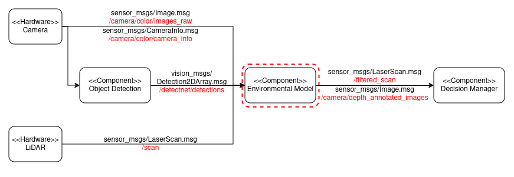

# Camera Lidar Sensor Fusion

## Description:
**This project utilizes point-to-pixel sensor fusion technique to measure the distance of detected objects using data from both 2D LiDAR and camera sensors.**

## Component Interface:
<p align="center">
  
</p>

## Description of the interface:

| Data | Component | Topic Name | Ros2 Message  | Description | 
| --------- | ---------- | ---------- | ----------- | ------ |
| Input | Camera | /camera/color/image_raw | sensor_msgs/Image.msg | Subscribes to the raw images from the camera. |
| Input | LiDAR | /scan | sensor_msgs/LaserScan.msg | Subscribes to LiDAR scan data to measure the distance of detected objects. |
| Input | Camera | /camera/color/camera_info | sensor_msgs/CameraInfo.msg | Subscribes to the camera intrinsic parameters. |
| Input | Object Detection | /detectnet/detections | vision_msgs/Detection2dArray.msg | Subscribes to the object detections. |
| Output| Decision Manager | /camera/depth_annotated_images | sensor_msgs/Image.msg | Publishes annotated images with bounding boxes, class labels, and distances for detected objects. |
| Output| Decision Manager | /filtered_scan | sensor_msgs/LaserScan.msg | Publishes filtered LiDAR scan data focusing on the objects within the camera's field of view. |

# Installation Instructions

To install the Environmental Model package, follow the steps below:

### Step 1: Clone the Repository

Initiate the process by launching a terminal and navigating to your workspace to clone the package. Subsequently, execute the following command to clone the repository:

```shell
git clone https://github.com/MohammadLabeeb/ros2-camera-lidar-sensor-fusion.git
```

### Step 2: Build the Package
Upon successful completion of the cloning process, go back to workspace
```shell
cd ..
```
Next, build the package by using the colcon command.
```shell
colcon build 
```

### Step 3: Source the Workspace
After the build process is complete, you'll need to source the workspace to make it accessible for ROS2.
```shell
source install/setup.bash
```
### Step 5: Run the node
You can now launch the environmental_model node along with the dependent nodes using the provided launch file:

```shell
ros2 launch environmental_model launch.py
```
